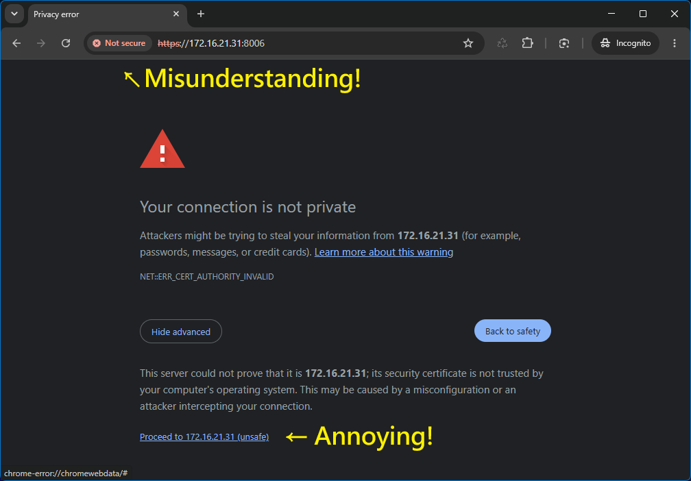
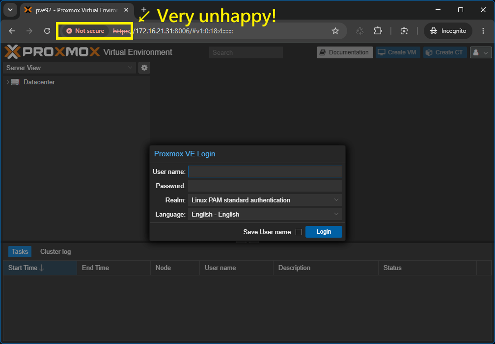
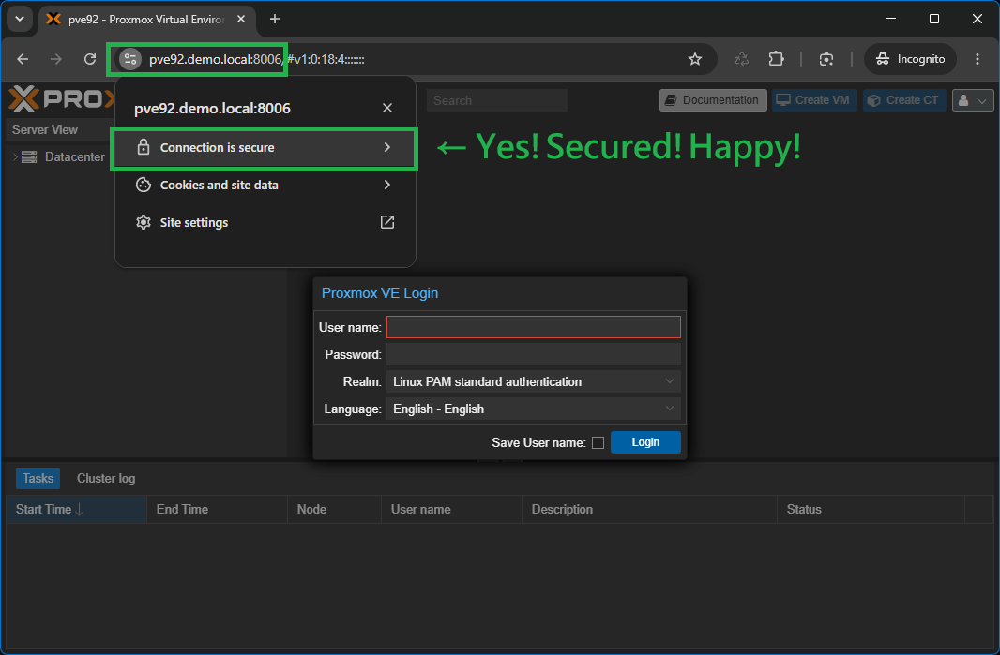
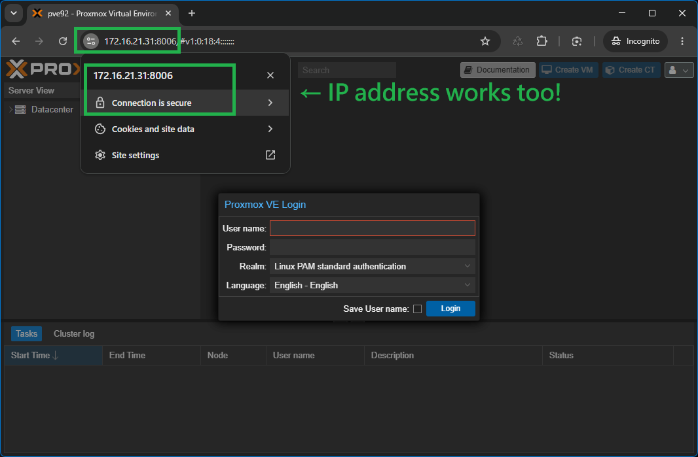

# pve-cert — Proxmox HTTPS, trusted on every client. One command. No domain. No internet. No annual renewal.

**English** | [繁體中文](README_tw.md)

Your Proxmox browser warning, permanently gone.

One command on the server, one command on each client —
your browser shows a padlock, stays that way for 10 years,
and works completely offline with no public domain required.

---

Every fresh Proxmox VE installation greets you with this:




---

## Files

| File | Platform | Purpose |
|------|----------|---------|
| `pve-cert.sh` | Proxmox VE (Node/Cluster) | Generate Root CA + node cert, install into PVE |
| `pve-cert-windows.bat` | Windows Client | Download CA cert, update hosts, import to Windows trust store |
| `pve-cert-linux.sh` | Linux Client (Ubuntu/Debian) | Download CA cert, update hosts, import to system + browser trust stores |
| `pve-cert-macos.sh` | macOS Client | Download CA cert, update hosts, import to macOS Keychain |

After running `pve-cert.sh` on the PVE server and the appropriate client script on each machine, the warning is gone:




---

## Compatibility

**Proxmox VE (Server)**
- PVE 7.x or later

**Client OS**

| OS | Version |
|----|---------|
| Windows | 10, 11 (x86 / ARM) |
| Linux | Ubuntu 20.04+, Debian 11+ (x86 / ARM) |
| macOS | 12 Monterey+ (Intel / Apple Silicon) |

**Browser**

| Browser | Notes |
|---------|-------|
| Chrome / Chromium | ✅ Auto-imported on Linux; follows system trust on Windows / macOS |
| Firefox | ✅ Auto-imported on Linux (incl. snap); follows system trust on Windows / macOS |
| Edge | ✅ Follows Windows / macOS system trust store |
| Safari | ✅ Follows macOS Keychain |

---

## Why Use This Script?

There are several ways to handle TLS certificates for a Proxmox VE Web UI. The table below compares the most common approaches.

### Certificate Method Comparison

| | **PVE Default Self-Signed** | **ACME / Let's Encrypt (HTTP-01)** | **Let's Encrypt + Cloudflare (DNS-01)** | **Commercial Wildcard Cert** | **This Script — Self-Signed CA + Client Trust** |
|---|---|---|---|---|---|
| **Browser warning** | ❌ Warning by default (can be suppressed by manually importing PVE Root CA on each client, but must be re-imported every year after renewal) | ✅ None | ✅ None | ✅ None | ✅ None (after client setup) |
| **Public domain required** | ✅ No | ❌ Yes | ❌ Yes | ❌ Yes | ✅ No |
| **Internet access required** | ✅ No | ❌ Yes (port 80/443) | ❌ Yes (DNS API) | ❌ Yes | ✅ No — fully air-gapped |
| **Expiry / renewal** | 1 year, auto-renew | 90 days, auto-renew | 90 days, auto-renew | 1–2 years, manual | Configurable (default 10 yr) |
| **Client re-setup on renewal** | ❌ Yes — re-import on every client | ✅ None | ✅ None | ✅ None | ✅ None — Root CA stays trusted |
| **Setup complexity** | None (warning persists by default) | Medium | Medium–High | Low–Medium | Low |
| **Extra services needed** | None | None | Cloudflare account + API token | None | None |
| **Hostname exposed publicly** | ✅ No | ❌ Yes (CT logs) | ❌ Yes (CT logs) | ❌ Yes | ✅ No |
| **Works on isolated LAN** | ✅ Yes | ❌ No | ❌ No | ❌ No | ✅ Yes |
| **Multi-client trust** | Manual per client, repeated each renewal | Automatic | Automatic | Automatic | One-time per client |
| **Cost** | Free | Free | Free | $100–300/yr | Free |
| **Access by FQDN** | ✅ Yes (but browser warning still shown unless PVE Root CA is manually imported) | ✅ Yes | ✅ Yes | ✅ Yes | ✅ Yes |
| **Access by IP** | ✅ Yes (but browser warning still shown) | ❌ No | ❌ No | ❌ No | ✅ Yes (SAN includes IP) |
| **PVE Web UI cert management** | ✅ Yes (server-side only) | ✅ Yes (server-side only) | ✅ Yes (server-side only) | ❌ Manual | ❌ Manual (this script) |

---

### When to Use Each Method

**PVE Default Self-Signed**

The out-of-the-box certificate. Fast to get started, but shows a browser warning by default. The warning can be suppressed by manually importing the cert on each client, but requires re-import every year when the cert renews. Acceptable for a quick lab test, not for daily use.

**ACME / Let's Encrypt (HTTP-01)**

Built into the Proxmox Web UI under Datacenter → pve → Certificates. Requires a publicly reachable domain and open ports 80/443. Not suitable for internal-only servers behind NAT or on air-gapped networks.

**Let's Encrypt + Cloudflare DNS-01**

Validation happens via DNS API, so port 80/443 does not need to be exposed. Requires a public domain managed through Cloudflare (or another supported DNS provider) and an API token. The hostname appears in public Certificate Transparency logs. Suitable for any environment — homelab or enterprise — that has a public domain managed through a supported DNS provider and is comfortable with hostnames appearing in CT logs.

**Commercial Wildcard Certificate**

Covers all subdomains of a public domain (`*.demo.local` is not valid — a real public TLD is required). High cost and typically manual renewal. Only worth it for production environments with existing public domain infrastructure.

**This Script — Self-Signed CA + Client Trust**

✅ Recommended for any internal infrastructure without a public domain

Generates a private Root CA and a node certificate with proper SAN entries (DNS + IP), and installs it into PVE. Each client machine then runs the client script once to import the CA and gain trusted access — no public domain, no internet access, no port forwarding, no subscription required.

Best suited for:
- Any internal infrastructure with no public domain — homelab, SMB, or enterprise private cloud
- Air-gapped or NAT-only networks
- Environments where hostnames must not appear in public CT logs
- Multiple PVE nodes each needing their own trusted cert
- Users who want a one-command setup on both server and client

The main trade-off is that every new client machine needs to run the client script once to import the CA. Unlike importing the PVE default cert directly, the Root CA does not change on renewal — so clients never need to re-import.

---

## How It Works

```
┌─────────────────────────────────────────────────┐
│  Proxmox VE Server                              │
│                                                 │
│  pve-cert.sh                                    │
│  ├── Auto-detect IP / FQDN                      │
│  ├── Generate Root CA  (pve-local-ca.crt/.key)  │
│  ├── Generate node cert signed by Root CA       │
│  ├── Install to /etc/pve/local/                 │
│  └── Restart pveproxy / pvedaemon               │
└────────────────┬────────────────────────────────┘
                 │  scp  pve-local-ca.crt
                 ▼
┌─────────────────────────────────────────────────┐
│  Client Machine  ← repeat for each client       │
│                                                 │
│  pve-cert-windows.bat  /  pve-cert-linux.sh     │
│  pve-cert-macos.sh                              │
│  ├── Download CA cert via scp                   │
│  ├── Auto-detect FQDN via ssh hostname -f       │
│  ├── Add entry to hosts file                    │
│  └── Import CA cert to system trust store       │
└─────────────────────────────────────────────────┘
                 │
                 ▼
     https://pve.demo.local:8006  🔒
```

---

## Requirements

### Proxmox VE Server
- Run as `root`
- `openssl` installed (included in PVE by default)

### Windows Client
- Run as **Administrator**
- OpenSSH Client enabled (Windows 10 build 1809+)
  - Settings → Apps → Optional Features → OpenSSH Client
- `pve-cert.sh` must have been run on the PVE server first

### Linux Client (Ubuntu / Debian)
- Run with `sudo`
- `openssh-client` and `openssl` installed
  - `sudo apt install openssh-client openssl`
- `ca-certificates` package installed (provides `update-ca-certificates`)
  - `sudo apt install ca-certificates`
- `libnss3-tools` installed (provides `certutil`, for Firefox / Chrome NSS store import)
  - `sudo apt install libnss3-tools`
  - The script will install this automatically if missing
- `pve-cert.sh` must have been run on the PVE server first

### macOS Client
- Run with `sudo`
- `ssh`, `scp`, `openssl`, and `security` are all included with macOS — no extra install needed
- `pve-cert.sh` must have been run on the PVE server first

---

## Download

Clone this repository on the PVE server and on each client machine:

**On Proxmox VE (SSH):**
```bash
git clone https://github.com/anomixer/pve-cert.git
cd pve-cert
```

**On Windows (Command Prompt or PowerShell):**
```cmd
git clone https://github.com/anomixer/pve-cert.git
cd pve-cert
```

**On Linux / macOS (Terminal):**
```bash
git clone https://github.com/anomixer/pve-cert.git
cd pve-cert
```

> Or [download the ZIP directly](https://github.com/anomixer/pve-cert/archive/refs/heads/main.zip) and extract it.

---

## Installation

### Step 1 — Run on the Proxmox VE server

```bash
sudo bash pve-cert.sh
```

The script will:
1. Auto-detect PVE IP and FQDN (`hostname -f`)
2. Confirm the details with you before proceeding
3. Generate `Proxmox VE Local Root CA` and a node certificate with SAN entries for both the DNS name and IP address
4. Back up existing certs to `/etc/pve/local/pveproxy-ssl.pem.bak.<timestamp>`
5. Install the new certificate and restart `pveproxy` / `pvedaemon`
6. Print the full certificate details and all output file locations

**Output files on PVE:**

| File | Description |
|------|-------------|
| `/root/pve-local-ca.crt` | Root CA certificate (downloaded by client scripts) |
| `/root/pve-local-ca.key` | Root CA private key — keep on server, do not share |
| `/root/pve-node.crt` | Node certificate |
| `/root/pve-node.key` | Node private key |
| `/etc/pve/local/pveproxy-ssl.pem` | Active certificate used by PVE Web UI |
| `/etc/pve/local/pveproxy-ssl.key` | Active private key used by PVE Web UI |

**Multiple PVE servers:** if you have more than one Proxmox VE server, run `pve-cert.sh` on each server individually. Every server generates its own independent Root CA and node certificate.

---

### Step 2 — Run on each client machine

Run the script for your OS:

**Windows** — right-click `pve-cert-windows.bat` → Run as administrator
```bat
pve-cert-windows.bat
```

**Linux (Ubuntu / Debian)**
```bash
sudo bash pve-cert-linux.sh
```

**macOS**
```bash
sudo bash pve-cert-macos.sh
```

All three scripts follow the same steps:
1. Ask for the PVE IP address and SSH username
2. Download `pve-local-ca.crt` from PVE via `scp` (prompts for SSH password once)
3. Auto-detect the PVE FQDN via `ssh hostname -f`
4. Add an entry to the system hosts file
5. Import the CA cert into the OS trust store
6. Optionally open the PVE Web UI in the default browser

**Linux additionally** imports the CA cert into the NSS store used by Chrome, Chromium, and Firefox (including snap-packaged Firefox on Ubuntu 21.10+), so no manual browser steps are needed.

**Multiple client machines:** run the appropriate script independently on every machine that needs access to the PVE Web UI without a certificate warning.

**Multiple PVE nodes:** run the client script once per PVE node on the same machine. The script accumulates site entries without overwriting existing ones — each site is tracked by IP, FQDN, and cert fingerprint.

---

### Step 3 — Open the Web UI

Restart your browser, then navigate to either the FQDN:

```
https://<your-pve-fqdn>:8006
```

or directly by IP address:

```
https://<your-pve-ipaddr>:8006
```

Both work without a certificate warning — the certificate SAN includes both the FQDN and the IP address. The browser should show a padlock 🔒. Using the FQDN is recommended for day-to-day use (see [Notes](#notes) for details).

---

## Uninstall

### PVE Server

```bash
sudo bash pve-cert.sh -u
```

- Finds the most recent backup and restores it automatically
- Restarts `pveproxy` / `pvedaemon`

### Client Machine

**Windows** — run as Administrator:
```bat
pve-cert-windows.bat -u
```

**Linux:**
```bash
sudo bash pve-cert-linux.sh -u
```

**macOS:**
```bash
sudo bash pve-cert-macos.sh -u
```

All three present a numbered list of registered sites:

```
  Registered PVE sites:
  -----------------------------------
    [1]  192.168.1.111  <>  pve1.demo.local
    [2]  192.168.1.112  <>  pve2.demo.local
    [0]  Remove ALL

  Select [1-2, 0=all]:
```

For each selected site, the script will:
- Remove the hosts entry
- Remove the CA cert from the OS trust store (matched by fingerprint)
- Remove the CA cert from browser NSS stores (Linux: Chrome/Chromium and Firefox including snap)
- Delete the local cert file from the data directory

---

## Notes

### Client Script Comparison

| | **Windows** | **Linux** | **macOS** |
|---|---|---|---|
| **Script** | `pve-cert-windows.bat` | `pve-cert-linux.sh` | `pve-cert-macos.sh` |
| **Run as** | Administrator | `sudo` | `sudo` |
| **Hosts file** | `C:\Windows\System32\drivers\etc\hosts` | `/etc/hosts` | `/etc/hosts` |
| **Trust store** | Windows Root CA store (`certutil`) | System CA bundle (`update-ca-certificates` / `update-ca-trust`) + NSS store (Chrome/Firefox) | macOS Keychain (`security`) |
| **Cert fingerprint** | SHA-1 thumbprint (PowerShell) | SHA-256 (openssl) | SHA-1 (openssl + Keychain) |
| **Data directory** | `%ProgramData%\pve-cert\` | `~/.local/share/pve-cert/` | `~/Library/Application Support/pve-cert/` |
| **Open browser** | `start` | `xdg-open` | `open` |
| **Extra dependencies** | OpenSSH Client (built-in Win10+) | `openssh-client`, `openssl`, `ca-certificates`, `libnss3-tools` (auto-installed if missing) | None (all built-in) |

---

### Why FQDN instead of IP address?

Browsers validate TLS certificates using the **Subject Alternative Name (SAN)** field, not just the Common Name (CN). A SAN entry can be either a DNS name or an IP address, but the two are treated as completely separate identifiers.

This script includes **both** in the certificate:

```
SAN: DNS:pve92.demo.local
     IP:192.168.21.92
```

So `https://192.168.21.92:8006` **will** work without a warning. However, using the FQDN is strongly recommended because:

- **IP addresses change.** If the PVE server is reassigned to a new IP, the cert SAN no longer matches and the warning returns. The FQDN stays stable as long as the `hosts` entry or DNS record is kept up to date.
- **Browser behaviour.** Some browsers (notably older Chrome/Edge builds) do not honour IP SANs in private CA certificates and will show a warning regardless.
- **Consistency.** Using the FQDN makes bookmarks, API calls, and scripts portable across environments without hardcoding IP addresses.

The `hosts` entry written by the client script maps the FQDN to the current IP, so the browser resolves correctly even without a local DNS server.

---

- **Certificate CN**: `Proxmox VE Local Root CA (<hostname>)`

- All persistent data is stored in a platform-specific directory:
  - **Windows:** `%ProgramData%\pve-cert\`
  - **Linux:** `~/.local/share/pve-cert/`
  - **macOS:** `~/Library/Application Support/pve-cert/`
